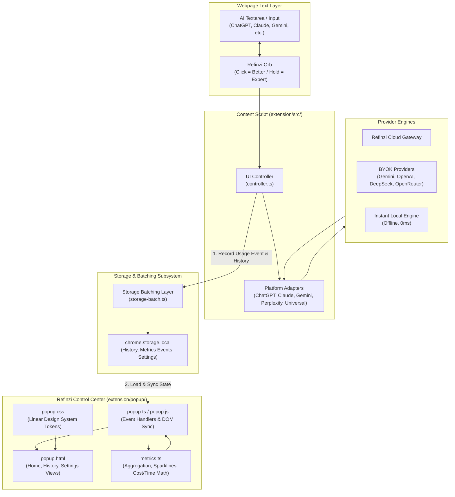

# Refinzi Dashboard Architecture & Feature Specification

> **Version**: 2.1.0  
> **Status**: Production Architecture Specification  
> **Target Platforms**: Chrome (MV3), Edge (MV3), Firefox (MV3)  
> **Module Root**: [`extension/popup/`](file:///e:/Antigravity%20Projects/Refinezy/Refinzi%202.0/extension/popup/) & [`extension/src/utils/metrics.ts`](file:///e:/Antigravity%20Projects/Refinezy/Refinzi%202.0/extension/src/utils/metrics.ts)

---

## 1. Executive Summary & Design Philosophy

The Refinzi Dashboard is the central control center and ROI visualization surface of the Refinzi browser extension. Designed with a clean, **Linear-inspired aesthetic**, it delivers instant visibility into productivity gains, engine health, and prompt history while maintaining an ultra-compact, distraction-free footprint.

### Core Architecture Principles

1. **ROI in Seconds**: Users immediately see the tangible value of prompt calibration: prompts enhanced, estimated time saved, estimated cost saved, and the Better vs. Expert mode distribution.
2. **Strict Uncluttered Constraint**: The Home view maintains an uncompromising layout of **exactly four primary metric cards**, **one period activity bar**, and **one engine banner**. Vanity metrics (e.g., arbitrary gamified "quality scores", streaks, or raw word counts) are deliberately excluded.
3. **Transparent & Honest Estimation**: Refinzi never presents estimated metrics as measured facts. If token pricing is unavailable, the UI gracefully displays `—` and `"Cost estimate unavailable"` rather than fabricating numbers.
4. **Zero-Lag Reactivity**: Metrics recalculation and DOM updates happen entirely within the local browser sandbox in sub-millisecond execution times, backed by a debounced storage batching layer.
5. **Privacy First**: All history, metrics, and API keys remain stored strictly inside `chrome.storage.local` on the user's device and are never transmitted to external analytics servers.

---

## 2. System Architecture & Component Interaction



---

## 3. Module File Hierarchy

| File | Purpose & Responsibilities |
| :--- | :--- |
| [`extension/popup/popup.html`](file:///e:/Antigravity%20Projects/Refinezy/Refinzi%202.0/extension/popup/popup.html) | Semantic structure for Header, Tab Navigation, Home Dashboard, History View, and Settings View. |
| [`extension/popup/popup.css`](file:///e:/Antigravity%20Projects/Refinezy/Refinzi%202.0/extension/popup/popup.css) | Complete design tokens, flex/grid layouts, SVG sparklines, split bars, toggle switches, and responsive dark/light styles. |
| [`extension/popup/popup.ts`](file:///e:/Antigravity%20Projects/Refinezy/Refinzi%202.0/extension/popup/popup.ts) | Popup controller managing active tab switching, period toggle filtering, metrics rendering, history searching/copying, and settings persistence. |
| [`extension/src/utils/metrics.ts`](file:///e:/Antigravity%20Projects/Refinezy/Refinzi%202.0/extension/src/utils/metrics.ts) | Mathematical calculation engine for time saved, token pricing, model turn costs, period date bucketing, and 7-day sparkline projection. |
| [`extension/src/utils/storage-batch.ts`](file:///e:/Antigravity%20Projects/Refinezy/Refinzi%202.0/extension/src/utils/storage-batch.ts) | High-performance debounced batch writer that coalesces rapid storage mutations into single disk operations to avoid storage quota throttling. |
| [`extension/src/utils/storage.ts`](file:///e:/Antigravity%20Projects/Refinezy/Refinzi%202.0/extension/src/utils/storage.ts) | Typed abstraction over `BrowserAPI.storage.local` with default settings and validation. |

---

## 4. Complete Feature Breakdown

### 4.1 Top Application Header
- **Brand Identity**: Refinzi icon (`◉`) with brand typography.
- **Engine Status Pill (`#global-status-pill`)**:
  - Live indicator showing connection state (`online`, `offline`).
  - Label reflecting active provider (e.g., `Local Ready`, `Gemini 3.8 Flash`, `Gateway Connected`).
  - One-click shortcut jumping directly to the Settings tab for rapid configuration.
- **Context Pill (`#tab-context-pill`)**:
  - Automatically queries the active browser tab via `chrome.tabs.query`.
  - Displays green dot + site name when on a supported platform (e.g., `Active on ChatGPT`, `Active on Claude`, `Active on Gemini`, `Active on Perplexity`).
  - Displays `Universal Ready` on arbitrary web pages with text inputs.
  - Displays `Inactive on this page` on internal browser surfaces (`chrome://`).

---

### 4.2 Home Tab (`#tab-home`): The Mini Dashboard

The Home Tab is engineered to deliver comprehensive awareness in a single viewport without scrolling.

#### 1. Period Toggle Group (`.period-toggle-group`)
- **Ranges**: `Today` | `Week` (Default) | `Month` | `All Time`.
- Segmented pill design with smooth highlight transitions.
- Dynamically recalculates all metrics and the sparkline in real time upon selection.

#### 2. Four Primary Metrics Grid (`.metrics-grid-four`)

```
┌───────────────────────────────┬───────────────────────────────┐
│ PROMPTS ENHANCED            ✦ │ TIME SAVED                  🕒│
│ 142                           │ ~5.9h                         │
│ +24 this week                 │ est. saved                    │
│ [∿∿∿∿ 7-Day Sparkline ∿∿∿∿]   │                               │
├───────────────────────────────┼───────────────────────────────┤
│ COST SAVED                  🪙 │ BETTER / EXPERT             ⚡🧠│
│ $12.40                        │ 118 / 24                      │
│ est. API cost avoided         │ this week                     │
│                               │ [████████████████░░░░]        │
└───────────────────────────────┴───────────────────────────────┘
```

1. **Prompts Enhanced (`#card-prompts-enhanced`)**:
   - Aggregate count of successful prompt enhancements in the selected period.
   - Subtitle indicating delta relative to period (e.g., `+12 this week`).
   - **7-Day Dynamic SVG Sparkline**: Polyline rendered directly from daily event counts across the last 7 calendar days with a gradient fill under the line.
2. **Estimated Time Saved (`#card-time-saved`)**:
   - Quantifies hours/minutes saved compared to manual prompt writing and back-and-forth clarification iterations.
   - Interactive tooltip explaining the exact formula.
   - Formatted dynamically: `~0m`, `~45m`, `~3.2h`.
3. **Estimated Cost Saved (`#card-cost-saved`)**:
   - Calculates AI API tokens saved and downstream hallucination/iteration costs avoided.
   - Graceful fallback: If cost cannot be estimated with certainty, displays `—` with `Cost estimate unavailable`.
4. **Better / Expert Usage Split (`#card-usage-split`)**:
   - Shows the exact ratio: `{betterCount} / {expertCount}`.
   - **Dual Glyph**: Bolt glyph (Better) + Brain glyph (Expert).
   - **Proportional Split Bar**: CSS flex bar with `--gold-accent` for Better mode and `#a78bfa` for Expert mode with smooth cubic-bezier transitions.

#### 3. Period Activity Breakdown Bar (`.period-activity-bar`)
- Centered compact pill showing breakdown:
  - **Better**: Count + Percentage (e.g., `Better 118 (83%)`) with pulsing gold status dot.
  - **Divider**: `/`
  - **Expert**: Count + Percentage (e.g., `Expert 24 (17%)`) with pulsing violet status dot.

#### 4. BYOK Engine Status Banner (`.engine-banner`)
- Displays currently active model / engine tag (`ENGINE`, `BYOK`, or `LOCAL`).
- Displays engine name (e.g., `Google Gemini (Gemini 3.8 Flash)`).
- **Free-Tier Warning**: If cloud gateway turns are depleted, banner enters `.warn` state highlighting remaining free quota.
- **Configure Link**: Instant navigation to provider settings.

#### 5. Progressive Expert Coach Card (`#expert-coach-card`)
- Appears conditionally when the user has utilized Better mode multiple times but has never held for Expert mode (`expertCount === 0 && betterCount > 0`).
- Features an animated dashed pulsing hold ring mimicking the physical 350ms hold interaction.
- Dismissable with persistent state stored in `chrome.storage.local`.

#### 6. Recent Calibrations List (`#home-recent-list`)
- Displays the 3 most recent prompt optimizations with:
  - Platform icon/badge (ChatGPT, Claude, Gemini, Perplexity, Universal).
  - Mode indicator (⚡ Better / 🧠 Expert).
  - Elapsed relative time (e.g., `2m ago`, `1h ago`).
  - Truncated prompt preview.
  - One-click copy icon that copies the calibrated prompt to the system clipboard with green checkmark feedback.
- Clean empty state when no calibrations have occurred yet with immediate onboarding guidance.

---

### 4.3 History Tab (`#tab-history`)

The History module provides a full audit trail of past prompt enhancements:
- **Instant Search**: Debounced text search matching original prompts, calibrated outputs, or target platforms.
- **Mode Filter**: Quick filter by All, Better mode, or Expert mode.
- **Item Expansion**: Expandable cards revealing full prompt diffs, latency, and token consumption.
- **Actions**:
  - Individual prompt deletion.
  - One-click copy output.
  - Clear All History with safety confirmation.
  - Privacy toggle to disable history storage entirely.

---

### 4.4 Settings Tab (`#tab-settings`)

The Settings module allows complete customization of AI engines, interaction mechanics, and dashboard assumptions:

#### Provider & BYOK Architecture
- **Provider Selection**:
  - `gateway`: Refinzi Cloud Gateway (Default, Zero configuration, free tier included).
  - `gemini`: Google Gemini (BYOK — Gemini 3.8 Flash, Gemini Pro).
  - `openai`: OpenAI (BYOK — GPT-5.6 Luna/Terra/Sol, GPT-4o).
  - `deepseek`: DeepSeek (BYOK — DeepSeek-V4.1 Flash, DeepSeek-V4 Pro).
  - `openrouter`: OpenRouter (BYOK — Multi-model routing).
  - `local`: Instant Local Engine (Offline, 0ms latency, zero API key required).
- **Dynamic Guidebook**: Contextual step-by-step setup cards detailing exactly where to obtain API keys with direct links.
- **Key Verification Engine**: "Verify" button that tests live connectivity against the selected model API before saving.

#### Interaction Tuning
- **Auto-Replace In-Place Toggle**: Replaces the prompt immediately upon calibration completion (zero friction) or shows review preview.
- **Hold Duration for Expert**: Configurable threshold (`300ms` Fast, `350ms` Recommended, `450ms` Deliberate, `600ms` Slow).
- **Default Mode Selection**: Set default trigger preference.
- **Replay Onboarding Guide & Reset Orb Position**: Troubleshooting utilities.

#### User-Configurable Estimation Assumptions
Users can customize the mathematical assumptions driving the dashboard:
- **Min / prompt** (Default: `2.5 min`, Range: 0.5 – 30 min).
- **Iterations avoided** (Default: `1.5`, Range: 0 – 5).
- **Fallback $/turn** (Default: `$0.008`, Range: $0 – $1).

---

## 5. Mathematical Estimation & ROI Algorithms

The formulas powering the dashboard are encapsulated within [`extension/src/utils/metrics.ts`](file:///e:/Antigravity%20Projects/Refinezy/Refinzi%202.0/extension/src/utils/metrics.ts):

### 5.1 Estimated Time Saved

$$\text{Time Saved (minutes)} = N_{\text{prompts}} \times M_{\text{perPrompt}} + \left( N_{\text{prompts}} \times I_{\text{avoided}} \times M_{\text{perPrompt}} \right)$$

Where:
- $N_{\text{prompts}}$: Total enhanced prompts in period.
- $M_{\text{perPrompt}}$: Estimated minutes to write and refine a prompt manually (default $2.5$).
- $I_{\text{avoided}}$: Follow-up clarification iterations avoided due to first-shot prompt precision (default $1.5$).

### 5.2 Estimated Cost Saved

$$\text{Direct API Cost} = \left(\frac{\text{Tokens}_{\text{in}}}{1000} \times P_{\text{in}}\right) + \left(\frac{\text{Tokens}_{\text{out}}}{1000} \times P_{\text{out}}\right)$$

$$\text{Avoided Iteration Cost} = N_{\text{prompts}} \times I_{\text{avoided}} \times C_{\text{turn}}$$

Where $C_{\text{turn}}$ is the model-specific blended turn cost from `MODEL_PRICING` (or $C_{\text{fallback}}$ if the specific model is unlisted).

### 5.3 7-Day Sparkline Algorithm

1. The last 7 days are projected into an array of date keys `YYYY-MM-DD`.
2. Event counts are bucketed into each day.
3. Points are normalized to an SVG viewBox of `120 × 28`:
   $$X_i = i \times \frac{120}{6} \quad (i \in [0..6])$$
   $$Y_i = 26 - \left(\frac{\text{Count}_i - \text{Min}}{\text{Max} - \text{Min}} \times 20\right)$$
4. A polyline is drawn with `stroke-width: 1.5`, and a closed polygon is rendered for the soft gradient fill.

---

## 6. Design System & CSS Token Specifications

The dashboard uses a unified color palette and typography system defined in [`extension/popup/popup.css`](file:///e:/Antigravity%20Projects/Refinezy/Refinzi%202.0/extension/popup/popup.css):

```css
:root {
  /* Background Hierarchy */
  --bg-main: #09090b;          /* Main application backdrop */
  --bg-card: #141418;          /* Dashboard tile background */
  --bg-card-hover: #1a1a20;    /* Interactive card hover */
  --bg-input: #18181b;         /* Inputs and selects */

  /* Border & Separation */
  --border-subtle: rgba(255, 255, 255, 0.08);
  --border-active: rgba(255, 215, 0, 0.4);

  /* Typography Colors */
  --text-primary: #ffffff;      /* Headings & key metrics */
  --text-secondary: #a1a1aa;    /* Labels & descriptions */
  --text-muted: #71717a;        /* Hints & inactive items */

  /* Functional Accents */
  --gold-accent: #ffd700;       /* Better Mode / Refinzi Brand */
  --gold-dim: rgba(255, 215, 0, 0.12);
  --emerald-accent: #10b981;    /* Time & ROI savings */
  --indigo-accent: #6366f1;     /* Primary actions */
  --danger-accent: #ef4444;     /* Destructive actions */

  /* Geometry */
  --radius-sm: 6px;
  --radius-md: 8px;
  --radius-lg: 12px;
}
```

- **Fixed Dimensions**: Shell width is strictly locked to `380px`, ensuring consistent pixel density across all browser popup frames.
- **Accessibility**: Includes high-contrast focus rings (`:focus-visible`) and respects user OS settings with `@media (prefers-reduced-motion: reduce)`.

---

## 7. Quality Assurance & Automated Test Architecture

The dashboard is protected by an extensive automated test suite running in Vitest with JSDOM:

1. [`extension/test/popup_dom.test.ts`](file:///e:/Antigravity%20Projects/Refinezy/Refinzi%202.0/extension/test/popup_dom.test.ts):
   - Asserts all 4 metric elements, period toggle buttons, and activity breakdown pills are present.
   - Enforces the **uncluttered invariant**: exactly 4 `.dash-card` elements, 1 `.period-activity-bar`, and 1 `.engine-banner`.
   - Strictly asserts the absence of vanity metrics (`metric-quality-score`, `metric-streak`, `metric-words`).
2. [`extension/test/popup_runtime.test.ts`](file:///e:/Antigravity%20Projects/Refinezy/Refinzi%202.0/extension/test/popup_runtime.test.ts):
   - Tests live period switching (`Today` vs `Week` vs `Month` vs `All Time`).
   - Validates correct formatting of zero states, high volume states, and cost calculations.
   - Validates coach card rendering and dismissal persistence.
3. [`extension/test/metrics_dashboard.test.ts`](file:///e:/Antigravity%20Projects/Refinezy/Refinzi%202.0/extension/test/metrics_dashboard.test.ts):
   - Validates token mathematical calculations across 20+ LLM models.
   - Tests timezone and midnight date bucketing boundaries.
   - Tests sparkline normalization algorithms.
