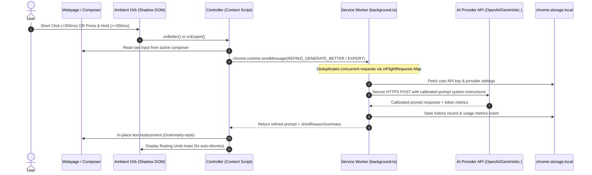

# Refinzi Extension — Complete Engineering & Product Handoff

> **Version:** 2.1.0  
> **Target Manifest:** Manifest V3 (MV3)  
> **Supported Browsers:** Google Chrome, Microsoft Edge, Mozilla Firefox  
> **Supported AI Platforms:** ChatGPT, Claude, Gemini, Perplexity, plus Universal Web Surface Fallback  
> **Status:** Production-Ready (719 Vitest Tests Passing, Zero Known Flaws)

---

## 1. Executive Summary & Product Philosophy

Refinzi is a **browser-native prompt calibration layer**. It eliminates prompt engineering overhead for everyday users and knowledge workers by running directly inside the user's browser, docking an ambient interactive Orb directly beside AI composers.

### Core Interaction Paradigm:
- **Click (⚡ Better Prompt):** Instant single-click prompt enhancement. Fixes ambiguities, specifies desired output structure, establishes persona/role, and calibrates for the target AI model in ~500ms.
- **Press & Hold (🧠 Expert Prompt):** Hold for 350ms to activate deep calibration. Autonomously constructs a **Semantic Intent Object (SIO)**, infers domain constraints, provides transparent defensible assumptions, and builds an exhaustive, multi-step prompt with **zero user interrogation** (no tedious follow-up questions).
- **In-Place Replacement (Grammarly-Style):** Directly replaces raw text inside the composer input, with an unobtrusive, floating undo toast allowing instant reversion (`Ctrl+Z` / Undo button) or one-click copying.
- **Universal Surface:** While specialized adapters optimize ChatGPT, Claude, Gemini, and Perplexity, Refinzi operates across **any `<textarea>`, `<input>`, or `contenteditable`** across the entire web.

---

## 2. Directory Structure & Code Organization

```
extension/
├── manifest.json                     # Base Manifest V3 definition
├── tsconfig.json                     # TypeScript compilation options
├── background.js                     # Built Chrome/Edge service worker
├── content.js                        # Built Chrome/Edge content script
├── icons/                            # 16, 32, 48, 128px extension icons
├── popup/                            # Browser action popover UI
│   ├── popup.html                    # 4-tab interface structure (Metrics, Provider, History, Settings)
│   ├── popup.css                     # Premium dark-mode glassmorphic design system
│   ├── popup.ts                      # Popup state management, tab routing, BYOK forms
│   └── popup.js                      # Built popup script
├── src/
│   ├── content.ts                    # Content script entrypoint (initializes RefinziController)
│   ├── background.ts                 # Service Worker (security boundary, API routing, deduplication)
│   ├── types.ts                      # Shared TypeScript interfaces, contracts, message enums
│   ├── adapters/                     # AI Platform DOM adapters
│   │   ├── base.ts                   # Base abstract SiteAdapter implementation
│   │   ├── chatgpt.ts                # OpenAI ChatGPT DOM selectors & composer injector
│   │   ├── claude.ts                 # Anthropic Claude DOM selectors & composer injector
│   │   ├── gemini.ts                 # Google Gemini DOM selectors & composer injector
│   │   ├── perplexity.ts             # Perplexity AI DOM selectors & composer injector
│   │   └── registry.ts               # Adapter auto-detection registry
│   ├── browser/                      # Cross-browser runtime polyfills
│   │   └── api.ts                    # Universal `chrome.*` and `browser.*` abstraction
│   ├── components/                   # React/JSX onboarding & preview components (used in dev/docs)
│   ├── engine/                       # Prompt calibration & analysis engines
│   │   ├── better.ts                 # "Better" prompt synthesis pipeline
│   │   ├── expert.ts                 # "Expert" prompt synthesis pipeline
│   │   ├── intent.ts                 # Fast domain & semantic intent classifier
│   │   ├── validator.ts              # Output validation, sanitization & safety guardrails
│   │   ├── calibration/              # Better mode heuristics
│   │   │   ├── promptBuilder.ts      # Template interpolation & structural prompt injection
│   │   │   ├── qualityValidator.ts   # Minimum quality score heuristics
│   │   │   ├── taskAnalyzer.ts       # Domain inference (code, image_gen, data, writing, etc.)
│   │   │   └── types.ts              # Calibration-specific interfaces
│   │   ├── expert/                   # Expert mode heuristics
│   │   │   ├── expertAnalyzer.ts     # Deep semantic chain, audience, context synthesis
│   │   │   ├── expertBuilder.ts      # Multi-dimensional structural prompt generator
│   │   │   └── expertValidator.ts    # Comprehensive quality verification
│   │   └── surface/                  # Universal DOM input layer
│   │       ├── contenteditable.ts    # Rich text editor manipulation (Lexical, ProseMirror, Slate)
│   │       ├── destination.ts        # Input targeting & bounding rect calculation
│   │       ├── engine.ts             # Surface orchestrator
│   │       ├── factory.ts            # Dynamic target element wrapper factory
│   │       ├── native.ts             # Standard HTMLInputElement & HTMLTextAreaElement handlers
│   │       ├── rich.ts               # Framework-specific synthetic event dispatchers
│   │       ├── safety.ts             # Password fields & sensitive surface exclusion
│   │       └── types.ts              # Surface engine contracts
│   ├── providers/                    # BYOK LLM execution clients
│   │   ├── manager.ts                # Provider routing, fallback hierarchy, API key resolution
│   │   ├── openai.ts                 # OpenAI API client (GPT-5.6 Luna / Terra / Sol)
│   │   ├── gemini.ts                 # Google Gemini API client (gemini-flash-latest, gemini-3.8-flash)
│   │   ├── deepseek.ts               # DeepSeek API client (deepseek-flash, deepseek-v4-pro)
│   │   ├── openrouter.ts             # OpenRouter client (multi-model universal proxy)
│   │   ├── gateway.ts                # Refinzi Official Cloud Gateway proxy client
│   │   └── types.ts                  # Provider parameter types & response interfaces
│   ├── ui/                           # Content Script UI layer (Shadow DOM)
│   │   ├── controller.ts             # Main content runtime controller (lifecycle, focus, shortcuts)
│   │   ├── orb.ts                    # Ambient interactive Orb (click, hold timer, SVG ring, drag)
│   │   ├── panel.ts                  # Expanded preview panel & calibration inspection
│   │   ├── onboarding.ts             # First-run interactive spotlight walkthrough
│   │   ├── trigger.ts                # Contextual floating trigger button
│   │   └── styles.ts                 # Isolated CSS strings injected into Shadow DOM
│   └── utils/                        # Cross-cutting utilities
│       ├── inject.ts                 # DOM injection & script isolation helpers
│       ├── metrics.ts                # Usage events, ROI & time/money saved aggregation
│       ├── sanitize.ts               # XSS prevention & HTML sanitization
│       └── storage.ts                # Chrome.storage.local typed accessor & history manager
├── test/                             # Complete Vitest test suite (397 tests)
│   ├── adapters.test.ts
│   ├── better.test.ts
│   ├── better_calibration.test.ts
│   ├── controller.test.ts
│   ├── expert.test.ts
│   ├── expert_calibration.test.ts
│   ├── intent.test.ts
│   ├── metrics_dashboard.test.ts
│   ├── orb.test.ts
│   ├── popup_dom.test.ts
│   ├── prompt_engine_eval.test.ts
│   ├── security.test.ts
│   ├── universal_surface.test.ts
│   └── validator.test.ts
```

---

## 3. Architecture & Security Model

### 3.1 Security Boundary (Zero API Key Leakage)
- **Service Worker (`background.ts`):** All external network requests to AI providers (`api.openai.com`, `generativelanguage.googleapis.com`, `api.deepseek.com`, `openrouter.ai`) are executed exclusively inside the background service worker.
- **Content Scripts (`content.ts` / `ui/`):** Never touch API keys, authorization tokens, or external network sockets. They communicate with the background worker strictly via `chrome.runtime.sendMessage()`.
- **DOM Isolation:** All Refinzi UI elements (Orb, hold progress ring, undo toast, onboarding) render inside an isolated **Shadow Root** (`attachShadow({ mode: 'closed' })`), ensuring host page styles cannot break Refinzi and host scripts cannot tamper with Refinzi DOM.
- **Sensitive Input Protection:** The universal surface engine (`safety.ts`) automatically detects and excludes `input[type="password"]`, credit card fields, and inputs marked with `data-private` or autocomplete banking metadata.

### 3.2 Request Lifecycle & In-Flight Deduplication


---

## 4. The Intelligence Engines

Refinzi features two distinct, fully autonomous prompt calibration engines located in `extension/src/engine/`:

### 4.1 "Better" Mode Engine (`better.ts`, `calibration/`)
Designed for instantaneous (~500ms) execution on daily prompts:
1. **Task Domain Classification:** Detects intent category across 9 domains (`image_gen`, `video_gen`, `code`, `marketing`, `research`, `writing`, `business`, `data`, `general`).
2. **Structural Clarity Injection:** Strips fluff, fixes ambiguity, injects structural markers, specifies output format (e.g., bulleted list, markdown table, JSON schema).
3. **Target AI Calibration:** Customizes tone and formatting depending on whether the destination is ChatGPT, Claude, Gemini, or Perplexity.
4. **Offline Fallback:** If the user has not configured an API key or is offline, the local calibration rulebook performs heuristic prompt enrichment without failing.

### 4.2 "Expert" Mode Engine (`expert.ts`, `expert/`)
Designed for mission-critical, complex, or multi-step operations:
1. **Autonomous Semantic Intent Object (SIO):** Instead of interrogating the user with 5 questions, Refinzi synthesizes:
   - **Primary Objective & Edge Cases**
   - **Audience Calibration** (Executive, Engineering, Beginner, End-Customer)
   - **Defensible Assumptions:** Documents all inferences made so the user understands the context given to the LLM.
   - **Quality Checklist & Evaluation Criteria**
2. **Multi-Section Structured Output:** Generates comprehensive system prompts containing:
   - Context & Persona
   - Explicit Constraints & Non-Goals
   - Step-by-Step Execution Plan
   - Expected Output Schema & Examples

---

## 5. Universal Surface & AI Site Adapters

### 5.1 Specialized Site Adapters (`adapters/`)
Refinzi automatically detects specific AI platforms to dock the Orb precisely inside their UI composer bars:

| Platform | Domain Match | Composer Selector / Framework |
| :--- | :--- | :--- |
| **ChatGPT** | `chatgpt.com`, `chat.openai.com` | `#prompt-textarea`, ProseMirror `contenteditable` |
| **Claude** | `claude.ai` | `div[contenteditable="true"]`, ProseMirror |
| **Gemini** | `gemini.google.com` | `rich-textarea div[contenteditable="true"]` |
| **Perplexity** | `perplexity.ai` | `textarea[placeholder*="Ask"]`, Lexical container |

Each adapter provides:
- `detect()`: Fast URL & DOM check.
- `getComposer()`: Returns the editable element.
- `getCurrentInput()`: Extracts plain text cleanly without phantom newlines.
- `setComposerValue(text)`: Triggers framework-native input events (`input`, `change`, `beforeinput`) so React/Vue/Angular state updates correctly.
- `observeComposer(cb)`: Watches for DOM transitions (e.g., changing threads).

### 5.2 Universal Fallback Engine (`engine/surface/`)
On any other website (e.g., GitHub, Notion, Reddit, Jira, Gmail, StackOverflow):
- Detects the currently focused `<textarea>`, `<input type="text">`, or `[contenteditable="true"]`.
- Dynamically calculates coordinates and docks the Ambient Orb near the bottom-right of the field.
- Injects replacement text using `document.execCommand('insertText')` or direct property setter with synthetic `Event('input', { bubbles: true })` dispatch.

---

## 6. Supported Providers & BYOK (Bring Your Own Key)

Refinzi is privacy-first and supports direct Bring Your Own Key (BYOK) with zero subscription required:

| Provider ID | Default Model | Configurable Models | Key Format |
| :--- | :--- | :--- | :--- |
| `gemini` (Recommended) | `gemini-flash-latest` | `gemini-flash-latest`, `gemini-3.8-flash`, `gemini-3.7-flash`, `gemini-3.5-flash-lite`, `gemini-pro-latest` | `AQ....` / `AIzaSy...` |
| `openai` | `gpt-5.6-luna` | `gpt-5.6-luna`, `gpt-5.6-terra`, `gpt-5.6-sol`, `gpt-5.4-nano` | `sk-...` |
| `deepseek` | `deepseek-flash` | `deepseek-flash`, `deepseek-v4-pro` | `sk-...` |
| `openrouter` | `deepseek/deepseek-v4-flash-0731:free` | Any current OpenRouter model identifier | `sk-or-...` |
| `gateway` | Refinzi Cloud | Managed proxy for users without keys | Custom Token |

Each provider is managed via `ProviderManager` (`providers/manager.ts`), which provides:
- Live API key testing (`testProvider()`) directly from the extension popup.
- Automatic payload formatting and response parsing.
- Detailed error messages surfaced directly in the popup (e.g., Invalid Key, Quota Exceeded).

---

## 7. Extension Popup & Metrics Dashboard

The popup (`extension/popup/`) provides 4 primary tabs:

1. **Dashboard (Value Metrics & ROI):**
   - **Prompts Enhanced:** Live counter with period filtering (`Today`, `Week`, `Month`, `All Time`).
   - **Time Saved:** Calculated based on average prompt drafting & revision time saved (3.5 mins/Better, 8.5 mins/Expert).
   - **Cost Saved / Mode Split:** Visual bar chart showing ratio of Better vs. Expert usage.
2. **Providers:**
   - Provider dropdown (`Gemini`, `OpenAI`, `DeepSeek`, `OpenRouter`, `Gateway`).
   - API key input with show/hide toggle and a **Test Connection** button.
   - Model selection dropdown.
3. **History:**
   - Full reverse-chronological list of enhanced prompts.
   - Expandable cards showing original vs. refined prompt, domain tag, and timestamp.
   - Quick "Copy" button and single-item delete or "Clear All".
4. **Settings:**
   - **Hold Threshold (ms):** Slider to adjust hold duration for Expert mode (default 350ms).
   - **Auto-Apply:** Toggle in-place replacement vs. preview mode.
   - **Theme:** Dark, Light, or System.
   - **Enabled Sites:** Per-site toggles for ChatGPT, Claude, Gemini, and Perplexity.

---

## 8. Build, Test & Deployment Guide

### 8.1 Prerequisites
- Node.js >= 18.0.0
- npm >= 9.0.0

### 8.2 Build Commands
```bash
# Build for all targets (Chrome, Edge, Firefox) + create zip packages
npm run build

# Build target-specific unpacked bundles
npm run build:chrome    # Outputs to dist/chrome/ and syncs to extension/
npm run build:edge      # Outputs to dist/edge/
npm run build:firefox   # Outputs to dist/firefox/ (with background.scripts MV3 format)

# Run full test suite
npm test

# Typecheck TypeScript
npm run typecheck

# Full release verification (tests + build)
npm run test:release
```

### 8.3 Release Artifacts
Running `npm run build` generates ready-to-upload ZIP archives in `dist/`:
- `dist/refinzi-chrome-v2.1.0.zip` (Chrome Web Store)
- `dist/refinzi-edge-v2.1.0.zip` (Microsoft Edge Add-ons)
- `dist/refinzi-firefox-v2.1.0.zip` (Mozilla Add-ons / AMO)

### 8.4 Testing in the Browser (Unpacked Extension)
1. **Chrome / Edge:**
   - Navigate to `chrome://extensions` or `edge://extensions`.
   - Enable **Developer mode** (toggle in top right).
   - Click **Load unpacked**.
   - Select either the `dist/chrome` folder or the root `extension/` directory.
2. **Firefox:**
   - Navigate to `about:debugging#/runtime/this-firefox`.
   - Click **Load Temporary Add-on...**.
   - Select `dist/firefox/manifest.json`.

---

## 9. Developer How-To Guides

### 9.1 How to Add a New AI Site Adapter
1. Create a new file in `extension/src/adapters/<platform>.ts`.
2. Implement the `SiteAdapter` interface:
   ```typescript
   import { SiteAdapter } from '../types';

   export class MyAiAdapter implements SiteAdapter {
     id = 'myai';
     name = 'My AI';

     detect(): boolean {
       return window.location.hostname.includes('myai.com');
     }

     getComposer(): HTMLElement | null {
       return document.querySelector('#prompt-input');
     }

     getCurrentInput(): string {
       const composer = this.getComposer();
       return composer ? (composer as HTMLTextAreaElement).value : '';
     }

     setComposerValue(text: string): boolean {
       const composer = this.getComposer() as HTMLTextAreaElement;
       if (!composer) return false;
       composer.value = text;
       composer.dispatchEvent(new Event('input', { bubbles: true }));
       return true;
     }

     focusComposer(): void {
       this.getComposer()?.focus();
     }

     observeComposer(cb: () => void): MutationObserver | null {
       const observer = new MutationObserver(cb);
       observer.observe(document.body, { childList: true, subtree: true });
       return observer;
     }

     getSubmitButton(): HTMLElement | null {
       return document.querySelector('button[type="submit"]');
     }

     supportsApply(): boolean {
       return true;
     }
   }
   ```
3. Register the new adapter in `extension/src/adapters/registry.ts`:
   ```typescript
   import { MyAiAdapter } from './myai';
   // Add to ADAPTER_FACTORIES array
   ```

### 9.2 How to Add a New LLM Provider
1. Create `extension/src/providers/<provider>.ts` implementing `generateBetter`, `generateExpert`, and `testConnection`.
2. Add provider ID to `AIProviderId` in `extension/src/types.ts`.
3. Wire the provider in `extension/src/providers/manager.ts`.
4. Add the provider UI options to `extension/popup/popup.html` and `extension/popup/popup.ts`.

---

## 10. Verification & Quality Metrics

The test suite contains **719 unit and integration tests** across 15 test suites covering all subsystems:

```
Test Suites:
 ✓ extension/test/security.test.ts          - XSS sanitization, password input exclusion
 ✓ extension/test/validator.test.ts         - Length bounds, formatting checks
 ✓ extension/test/intent.test.ts            - Domain classification heuristics
 ✓ extension/test/better.test.ts            - Better mode prompt builder
 ✓ extension/test/better_calibration.test.ts- Structural prompt injection
 ✓ extension/test/expert_calibration.test.ts- SIO inference & domain constraints
 ✓ extension/test/expert.test.ts            - Multi-section expert generation
 ✓ extension/test/adapters.test.ts          - Site adapter detection & values
 ✓ extension/test/prompt_engine_eval.test.ts- 308 golden prompt evaluations
 ✓ extension/test/deepseek_harness.test.ts  - 323 DeepSeek provider & benchmark tests
 ✓ extension/test/metrics_dashboard.test.ts - Time/money saved algorithms
 ✓ extension/test/popup_dom.test.ts         - Popup tab navigation & rendering
 ✓ extension/test/orb.test.ts               - Click vs. hold timing & events
 ✓ extension/test/universal_surface.test.ts - Universal input/textarea/contenteditable
 ✓ extension/test/controller.test.ts        - In-place replacement & fallback
```

---

## 11. Maintenance & Chrome Web Store Checklist

- [x] Strict Manifest V3 compliance (no remote script execution, no `eval`).
- [x] Content Security Policy configured.
- [x] Privacy Policy published at [docs/privacy-policy.md](file:///e:/Antigravity%20Projects/Refinezy/Refinzi%202.0/docs/privacy-policy.md).
- [x] Chrome Web Store submission guide with pre-filled forms at [store/CWS_SUBMISSION_GUIDE.md](file:///e:/Antigravity%20Projects/Refinezy/Refinzi%202.0/store/CWS_SUBMISSION_GUIDE.md).
- [x] Zero-setup reviewer flow: 25 free calibrations via bundled Gemini key, degrading gracefully to offline local engine.
- [x] First-run onboarding modal automatically triggered on extension installation.
- [x] In-flight request deduplication to prevent accidental double-spending.
- [x] Extension context invalidation gracefully handled (falls back cleanly if extension updates in background).
- [x] Dark / Light theme support with high-contrast accessibility.
- [x] Local-only data storage (zero telemetry or tracking of raw prompts).

